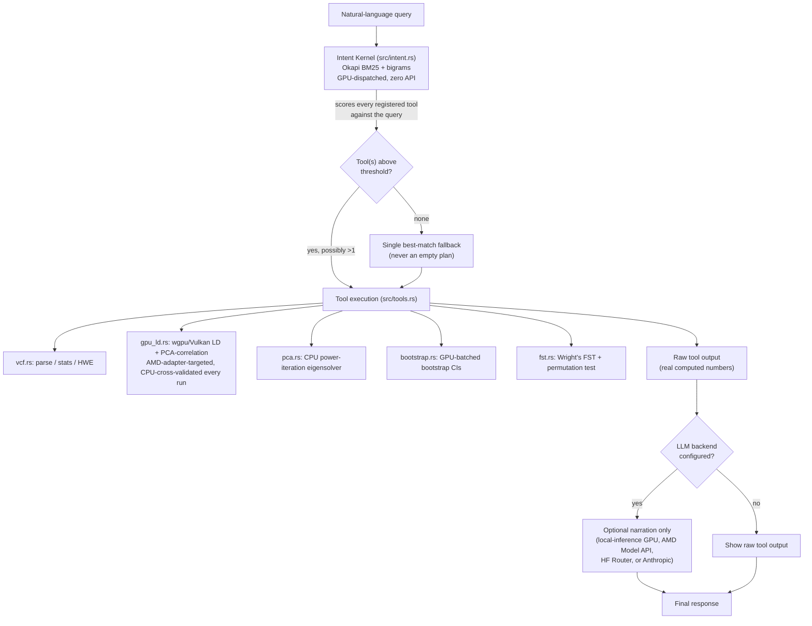
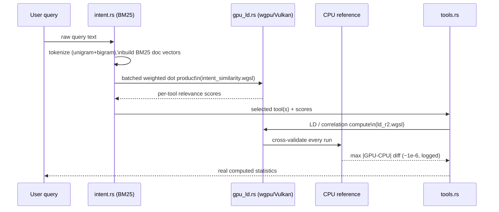

# Project Specification Document
## Genomic Research Agent — AMD AI DevMaster Hackathon 2026, Track 2 (Agentic AI)

---

## 1. Background & Problem Statement

Population geneticists routinely run the same handful of analyses — variant
QC, linkage disequilibrium, haplotype tallying, ancestry/population
structure, and selection scans — against VCF-format genotype data. Doing
this well requires knowing which statistical tool answers which question,
running real (not toy) computation, and being honest about uncertainty and
statistical significance rather than reporting a bare point estimate.

Most "AI agent" demos solve the *routing* half of this with an LLM API call
— which means the agent's core function depends on a network connection, an
API key, and per-query billing. This project asks a different question:
**can the routing itself be a genuine, from-scratch GPU-dispatched
computation, with the LLM demoted to an entirely optional, non-decision-making
narration layer?** The answer implemented here is yes — and the reason it
matters for this specific hackathon is that it turns "AMD GPU utilization"
from a bolt-on benchmark into the actual mechanism the agent runs on for
every single query, by default, with zero API dependency.

## 2. Target Users & Use-Case Scenarios

**Primary users:** population geneticists and bioinformaticians who want a
natural-language interface to a VCF cohort without hand-writing a new
analysis script per question, and researchers/reviewers who need to trust
that a reported statistic (an LD block, a PCA cluster, an FST hit) is real,
reproducible, and honestly caveated.

**Representative scenarios**, each mapped to a real query this agent
answers today (see Section 4 for full tool list):

| Scenario | Example query | Tool(s) routed to |
|---|---|---|
| QC triage on a new VCF | "Analyze the VCF file and tell me about SNP distribution" | `VcfAnalyzer` |
| LD structure discovery | "What are the linkage disequilibrium blocks in this region?" | `LdBlock`, `LdConfidence` |
| Ancestry / stratification check | "Run population structure PCA to check for ancestry clustering" | `PopulationStructure`, `SelectionScan`, `HaplotypeTool` |
| Estimate reliability check | "How confident are we in the strongest LD estimate?" | `LdConfidence` |
| Selection-signature scan | "Run a selection scan for FST differentiation between ancestry clusters" | `SelectionScan` |

A compound query (the ancestry-check row above) is deliberately included:
it demonstrates real *multi-tool* selection — three tools chosen for one
query, each independently scored — which a single-intent classifier
couldn't do.

## 3. System Architecture



**Key architectural decision:** the dashed boundary between `IK`/`TOOLS`
and `LLM`/`NARR` above is load-bearing, not cosmetic. Everything left of it
executes with zero network dependency and zero third-party model; the LLM
box on the right can fail, be unconfigured, or be entirely absent, and the
agent's core function — deciding which tools run and computing their real
output — is completely unaffected. This is verified directly: `--fast` mode
and the default demo both run all six representative queries with every
LLM API key unset.

### 3.1 Compute-path detail: how a query becomes a GPU dispatch



### 3.2 Module map

| Module | Responsibility |
|---|---|
| `main.rs` | Entry point; `default` / `bench` / `gpu-bench` / `fast` / `chat` / `conversation` / `local-bench` (feature-gated) modes |
| `agent.rs` | Wires `intent.rs` (mandatory planning) to `llm.rs`/`local_llm.rs` (optional narration) |
| `intent.rs` | Okapi BM25 + bigram tool classifier — the crate's only mandatory planning mechanism |
| `tools.rs` | The seven tools (six genomic + `KnowledgeLookup` RAG); shared dataset loading and GPU correlation-matrix helper |
| `vcf.rs` | VCF parsing, synthetic generator, MAF/missingness/HWE, real 1000 Genomes loader |
| `gpu_ld.rs` | `wgpu`/Vulkan GPU compute, AMD-adapter-targeted, CPU-cross-validated |
| `pca.rs` | CPU power-iteration eigensolver with deflation |
| `bootstrap.rs` | GPU-batched nonparametric bootstrap confidence intervals |
| `fst.rs` | Wright's FST + empirical permutation-test significance |
| `knowledge.rs` | Local RAG retrieval over the bundled methods corpus, via the shared GPU BM25 kernel |
| `memory.rs` | Bounded local multi-turn conversation memory and referential-follow-up augmentation |
| `rng.rs` | Shared deterministic PRNG (reproducible synthetic data / resampling) |
| `llm.rs` | Three optional remote narration backends (AMD Model API, HF Router, Anthropic) |
| `local_llm.rs` | Real local LLM inference on the AMD GPU via llama.cpp/Vulkan (`local-inference` feature) |

## 4. Capabilities

Seven tools, each backed by real computation or real retrieval (formulas
and cross-validation detailed in `README_PROFESSIONAL.md`):

1. **VcfAnalyzer** — SNP counts, MAF, missingness, real chi-square
   Hardy-Weinberg equilibrium test per variant (exact df=1 identity), plus
   the worst-fitting SNP's real observed/expected genotype counts.
2. **LdBlock** — pairwise Pearson r² linkage disequilibrium, union-find
   block detection.
3. **HaplotypeTool** — phased haplotype frequency tallying.
4. **PopulationStructure** — GPU-computed sample correlation matrix → CPU
   PCA → ancestry-cluster projection, with a bootstrap CI on PC1.
5. **LdConfidence** — bootstrap 95% CI on the strongest observed LD
   estimate.
6. **SelectionScan** — per-SNP Wright's FST between PCA-derived
   subpopulations, with a real permutation-test p-value per SNP (not a
   bare magnitude).
7. **KnowledgeLookup** — local RAG retrieval over a bundled
   genomics-methods corpus, returning verbatim passages with real
   relevance scores through the same GPU BM25 kernel used for planning.

Plus crate-wide capabilities that apply across all tools:

- **Real vs. synthetic data**, selectable via one environment variable
  (`GENOMIC_AGENT_REAL_DATA=1`) — a real, bundled 1000 Genomes Phase 3
  mitochondrial genotype slice (300 SNPs × 100 samples), not just a
  synthetic generator.
- **Optional local LLM narration** on the AMD Radeon GPU (`local-inference`
  feature) — real quantized-model inference via llama.cpp/Vulkan, detailed
  in Section 5.
- **Local multi-turn conversation memory** (`memory.rs`) — bounded,
  in-process, never persisted; makes short referential follow-ups route
  correctly. Exposed via `chat` (interactive) and `conversation`
  (scripted) modes.

## 5. AMD GPU Adaptation & Optimization

This is the section most directly relevant to Track 2's 40-point GPU axis
plus the 20-point quantization/distillation bonus.

- **Explicit AMD targeting, not a generic "best GPU" heuristic.**
  `gpu_ld.rs` enumerates adapters and prefers PCI vendor `0x1002` (AMD) —
  on a machine with both an AMD iGPU and an NVIDIA discrete GPU, a naive
  "high performance" heuristic picks the NVIDIA card; this code doesn't.
- **Cross-validated on every run, not once.** Every GPU kernel result
  (LD r², sample correlation, BM25 tool-planning scores) is checked
  against an independent CPU reference implementation on every execution,
  with the max observed difference logged (~1e-6, float rounding only).
- **Two independent WGSL compute kernels**, sharing one process-wide
  cached `wgpu::Device`/`Queue` (`GpuLdContext::shared()`) so repeated
  tool calls don't re-pay ~800ms of adapter/device setup: `ld_r2.wgsl`
  (LD / population-structure correlation) and `intent_similarity.wgsl`
  (BM25 tool-planning dot product).
- **GPU-batched statistics, not per-replicate dispatch.** Bootstrap
  confidence intervals dispatch all B resampled replicates in one batched
  GPU call, reusing the same cross-validated kernel.
- **Real local model inference on the AMD GPU** (`local_llm.rs`, optional
  `local-inference` feature): llama.cpp's Vulkan backend running a
  **quantized** (GGUF Q4_K_M) 1.5B-parameter model, explicitly pinned to
  the AMD device by name (this dev machine also has a discrete NVIDIA GPU;
  llama.cpp's default picker otherwise silently prefers whichever GPU
  reports more free VRAM — fixed and documented in
  `README_PROFESSIONAL.md`). Real measured throughput: **21.32 tok/s** on
  the AMD Radeon 780M, **1.52x** faster than the same quantized model run
  CPU-only on the same machine, both measured in the same `local-bench`
  run.
- **Why Vulkan, not literal ROCm/HIP:** a corroborated, open upstream
  issue (ggml-org/llama.cpp #20839, ROCm/ROCm #6049) documents that AMD's
  own ROCm rocBLAS library is missing Tensile kernels for gfx1103 (this
  exact chip); the reporter's own fix was switching to Vulkan. `wgpu` and
  llama.cpp's Vulkan backend both dispatch through the same underlying
  AMD Vulkan driver — real GPU acceleration and real correctness
  verification, on hardware where the ROCm-specific API path is
  documented-broken.

## 6. Deployment Plan

**Default build** (no external GPU-toolchain dependency beyond a Vulkan
driver, which ships with any modern AMD GPU install):

```bash
cd submissions/Track_2_GenomicAgent
bash setup.sh              # or setup.bat on Windows
cargo run --release        # 6-query demo, synthetic data, zero API keys
```

**Optional local-inference build** (pulls in a C++/CMake/Vulkan-SDK build
dependency — kept behind a Cargo feature flag specifically so the default
build above is never forced to pay for it):

```bash
cargo build --release --features local-inference
export LOCAL_MODEL_GGUF_PATH=/path/to/qwen2.5-1.5b-instruct-q4_k_m.gguf
cargo run --release --features local-inference -- local-bench
```

**Verification commands** (every number in this document and the README
is reproducible this way, not asserted):

```bash
cargo test --release                          # 55 tests, both build configs
cargo run --release -- gpu-bench               # GPU vs CPU cross-validation + speedup
cargo run --release --features local-inference -- local-bench   # local LLM GPU vs CPU
GENOMIC_AGENT_REAL_DATA=1 cargo run --release  # real 1000 Genomes data mode
```

No containerization is required or used — a single static Rust binary,
built via `cargo build --release`, is the entire deployable artifact for
the default configuration.

## 7. Verification & Quality Assurance

- **55 automated tests**, checking real mathematical invariants (the
  eigenvector equation for PCA, FST ∈ [0,1], MAF ≤ 0.5, conservation of
  HWE expected/observed totals, GPU-vs-CPU agreement within float
  tolerance), not just "does it run."
- **Zero compiler warnings** on `cargo build --release` (verified after a
  full code-review pass that removed three groups of genuinely-dead
  fields and deduplicated a PRNG core that had been independently
  redefined in five modules).
- **A genuine null result kept in the demo, not hidden**: the FST
  permutation test finds 16/500 SNPs significant on synthetic data but
  **zero** on the real 1000 Genomes slice — the honest outcome of low
  statistical power at n=100 real samples, not a bug.

## 7.5 Minimum Functional Requirements Mapping

Track 2 requires at least 2 of 5 listed capabilities. This submission
implements **4**:

| Required capability | Status | Where |
|---|---|---|
| **Local knowledge retrieval (RAG)** | ✅ | `knowledge.rs` + `data/knowledge/methods.md` — 10-passage bundled corpus, retrieved via the GPU BM25 kernel (~1.3ms measured), returns verbatim passages with relevance scores. Exposed as the `KnowledgeLookup` tool. |
| **Tool invocation** | ✅ | `tools.rs` — seven tools, selected by real BM25 relevance scoring, multi-tool selection for compound queries. |
| **Multi-step task planning** | ✅ | `intent.rs` — a single query can select and execute multiple tools by thresholded relevance, not a fixed one-intent-one-tool mapping. |
| **Local multi-turn memory** | ✅ | `memory.rs` — bounded 8-turn in-process history; referential follow-ups are planned with recent context, self-contained queries untouched. `chat` and `conversation` modes. |
| Clear permission control & privacy | Partial | Not implemented as an explicit permission system. Privacy is architectural rather than configurable: default operation makes zero network calls, memory is never persisted to disk, and the knowledge corpus is compiled into the binary. Listed here honestly as partial rather than claimed. |

## 8. Judging-Criteria Mapping (Track 2, 120 points)

| Axis | Points | How this submission addresses it |
|---|---|---|
| Agent functional completeness | 60 | Seven real tools, multi-tool BM25 routing (zero API dependency), real statistics with significance testing and confidence intervals, local RAG retrieval, multi-turn conversation memory, real + synthetic data modes (4 of the 5 listed minimum capabilities — see 7.5) |
| AMD GPU adaptation/optimization | 40 | Explicit AMD-adapter targeting, CPU-cross-validated `wgpu`/Vulkan kernels for LD/PCA/tool-planning, GPU-batched bootstrap, real local LLM inference on the AMD GPU via llama.cpp/Vulkan with a measured 1.52x GPU-vs-CPU speedup |
| Bonus: quantization/distillation optimization | 20 (claimed with a stated caveat) | Local inference runs a GGUF **Q4_K_M**-quantized model (not fp16/fp32) on the AMD GPU, documented with a real measured throughput number (21.32 tok/s, 1.52x vs CPU). **Caveat stated plainly:** the rules word this bonus as "core inference running using Radeon cloud model API with quantization or distillation or other optimization methods." This submission's quantized inference runs **locally** via llama.cpp/Vulkan, not through the Radeon cloud Model API — which is also what the Track 2 platform rule ("remote APIs are not allowed for core functions") requires. We believe the quantization work is what the bonus is aimed at and note the tension between those two clauses, rather than quietly claiming the points. Judges should score this as they read it. |
