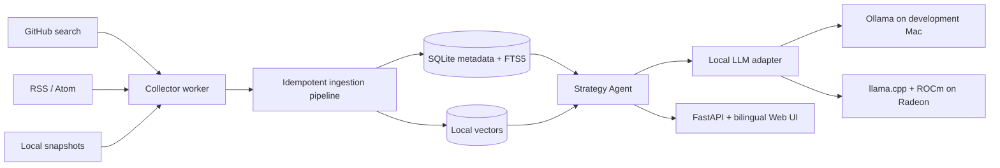

# OpenAlpha Sentinel

> Track 2: Private AI Agent Development and Local Deployment

OpenAlpha Sentinel is a local-first research agent that continuously discovers open-source quantitative strategy material, turns it into evidence-backed strategy cards, and answers questions with traceable source links. Public GitHub and RSS endpoints are data sources only. Extraction, retrieval, memory, orchestration, and generation run locally.

The project is designed for the 2026 AMD AI DevMaster Hackathon. Its verified server runtime uses `llama.cpp` with ROCm on one AMD Radeon GPU. A deterministic backend and Ollama adapter remain available for CPU-only development.

This is a research intelligence tool. It does not recommend securities, predict returns, connect to brokerage accounts, or place orders.

## What it does

- Collects public strategy research from GitHub repository search, RSS/Atom feeds, and local snapshots.
- Stores immutable revisions, content hashes, license metadata, source URLs, and line-level evidence.
- Extracts normalized strategy cards with type, market, timeframe, signals, cost disclosure, and research risk flags.
- Uses SQLite FTS5 plus local vector embeddings for hybrid RAG.
- Answers and compares strategies with server-validated source labels.
- Preserves multi-turn conversation history and explicitly saved research preferences locally.
- Runs typed tools through a visible bounded plan and audit trail.
- Persists recurring watch rules for a restartable 24x7 collector worker.
- Supports offline mode, domain grants, local memory export/delete, and no remote telemetry.

## Track 2 capability map

| Competition capability | Implementation |
|---|---|
| Local RAG | SQLite FTS5, local hash-vector baseline, evidence-grounded retrieval |
| Tool calling | Typed registry for search, card lookup, preference storage, and collectors |
| Multi-step planning | Bounded intent, tool, grounding, and memory steps returned with every answer |
| Local multi-turn memory | SQLite conversations, messages, and explicit preferences |
| Permission and privacy controls | Offline switch, domain grants, local-only model endpoints, audit log, memory deletion |

## Architecture



The API and collector worker are separate processes. The server lifecycle scripts use systemd when it is available and a validated PID/log process mode in disposable notebook instances. Collection can use the public internet, while all AI inference and private user state remain on the Radeon host.

## Current verification status

| Item | Status |
|---|---|
| Offline fixture ingestion, deduplication, RAG, citations, memory, API, CLI | 56 tests pass locally; the saved Radeon-host Python 3.12 run passed the earlier 35-test suite |
| Commit-pinned GitHub blob citations with original-file line offsets | Verified by regression tests and both final Radeon CLI/HTTP transcripts |
| Ollama `mistral:latest` local generation on Apple M4 Pro | Verified as a development backend |
| ROCm 7.2.1, HIP, `gfx1100`, approximately 48 GiB VRAM | Verified on Radeon Cloud |
| ROCm/llama.cpp build and Radeon device detection | Verified at pinned commit |
| Qwen3-8B model hash and application transports | Verified; saved CLI and HTTP 200 responses report `llama.cpp-rocm` with commit-pinned line citations |
| ROCm GPU offload | A separate clean-load trace reports `offloaded 37/37 layers to GPU` on `ROCm0`; `-ngl 99` remains the configuration upper bound |
| Fixed `llama-bench` snapshot | 3,033.77 +/- 154.27 prompt tok/s; 93.47 +/- 0.08 generation tok/s |
| Process restart and persistence | All three PIDs changed; health, repeat-seed idempotency, notification count, SQLite integrity, and foreign keys passed |
| 24-hour soak and comparative CPU/Radeon optimization study | Pending; not claimed as complete |

The repository does not claim unmeasured GPU performance. See [ROCm validation](ROCM_VALIDATION.md) and the [English benchmark report](submission/artifacts/BENCHMARK_REPORT.md).

## Radeon server quick start

Requirements:

- A ready Radeon Cloud instance with ROCm
- SSH Server and the workstation public key installed on that instance
- `ssh`, `rsync`, and Git on the workstation

```bash
umask 077
cp .env.example .env.server
chmod 600 .env.server
# Edit REMOTE_SSH_HOST and REMOTE_SSH_PORT, then:
./scripts/server_deploy.sh
./scripts/server_cli.sh seed
./scripts/server_status.sh
./scripts/server_tunnel.sh
```

Open `http://127.0.0.1:8765` while the tunnel is running. The API and model remain bound to the server loopback interface. The lifecycle scripts provide first-boot, daily-use, backup, and replacement-instance commands.

For a replacement cloud instance, create the SSH account/key, change only the first two connection values in `.env.server`, deploy, and restore the latest backup:

```bash
./scripts/server_deploy.sh
latest="$(ls -t data/server-backups/openalpha-*.tar.gz | head -1)"
./scripts/server_restore.sh --yes "$latest"
```

Always back up before destroying an instance:

```bash
./scripts/server_backup.sh
```

## Collection and questions

Run CLI operations on the configured server without repeating its IP or port:

```bash
./scripts/server_cli.sh seed
./scripts/server_cli.sh -- discover "mean reversion trading strategy license:mit" --limit 5
./scripts/server_cli.sh -- rss "https://example.org/strategy-feed.xml"
./scripts/server_cli.sh -- ask "Which strategies disclose transaction costs, and where are the sources?"
./scripts/server_cli.sh -- watch-add daily-mean-reversion github \
  "mean reversion strategy license:mit" --interval 360 --limit 5
```

The deploy command starts the persistent collector worker with the model and API. `server_start.sh`, `server_stop.sh`, and `server_status.sh` manage the configured instance.

## Local development fallback

Requirements are macOS or Linux and Python 3.11 or 3.12. The deterministic backend runs without a downloaded model:

```bash
./scripts/bootstrap_local.sh
.venv/bin/openalpha seed
./scripts/run_local.sh
```

To use an available local Ollama model:

```bash
ollama serve
OPENALPHA_LLM_BACKEND=ollama .venv/bin/openalpha serve
```

Collect a reproducible ROCm snapshot on the deployed host:

```bash
cd /workspace/openalpha-sentinel
./scripts/benchmark_rocm.sh
```

## CLI reference

```text
openalpha init                 Initialize SQLite
openalpha doctor               Check Python, SQLite FTS5, model, and data path
openalpha seed                 Load offline demonstration sources
openalpha serve                Run the localhost API and Web UI
openalpha worker               Run due watch rules continuously
openalpha discover QUERY       Search and ingest GitHub repositories
openalpha rss URL              Ingest RSS/Atom entries
openalpha ask QUESTION         Ask with local RAG and citations
openalpha watch-add ...        Create a persistent recurring rule
openalpha watch-list           List recurring rules
openalpha offline on|off       Disable or enable network collection
```

Interactive API documentation is available at `http://127.0.0.1:8765/docs`.

## Tests

```bash
.venv/bin/python -m pytest
.venv/bin/python -m pytest --cov=openalpha_sentinel --cov-report=term-missing
```

All default tests are offline. Live GitHub and remote GPU validation are intentionally separate so CI remains deterministic.

## Repository layout

```text
src/openalpha_sentinel/     Agent, collectors, RAG, API, worker, Web UI
fixtures/strategies/        Project-authored offline evidence fixtures
tests/                      Offline unit and integration tests
scripts/                    Local/server lifecycle, ROCm, backup, benchmark tools
deploy/systemd/             Optional persistent API, worker, and model services
submission/                 English official materials and saved evidence
data/runtime/               Local database/cache, ignored by Git
```

## Submission materials

The official English deliverables, checksums, and saved evidence are under [submission](submission).

- Project report
- Architecture document
- Demo script and video link sheet
- Slide deck source and poster source
- Benchmark report
- Submission checklist
- Pull Request body

Use the Pull Request title:

```text
Track 2, Coreline Systems Limited, OpenAlpha Sentinel
```

## License

OpenAlpha Sentinel is released under the [MIT License](LICENSE). Demo fixtures are project-authored. Collected third-party source code is not redistributed in the repository.
