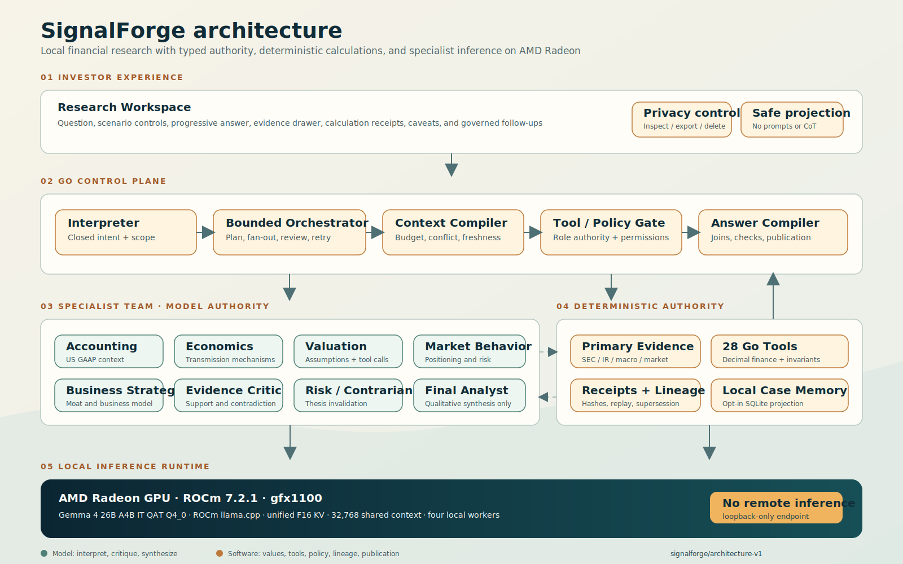
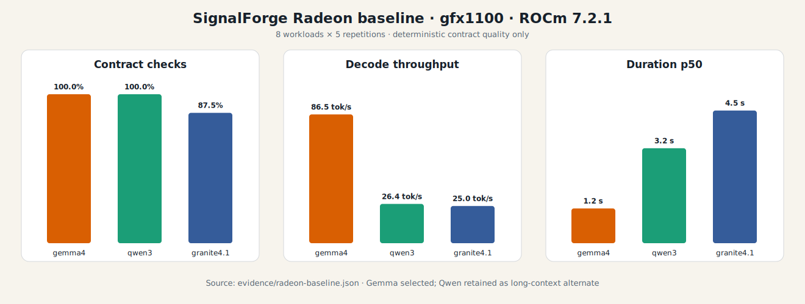
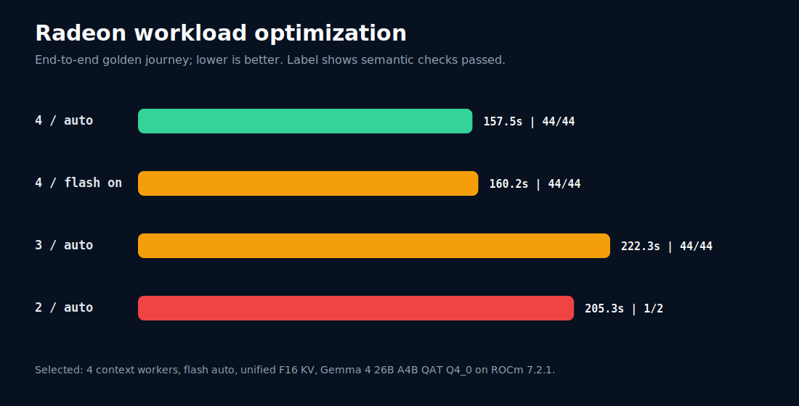

# SignalForge

SignalForge is a local-first financial research agent for turning public company filings,
macroeconomic series, and market data into auditable intelligence.

SignalForge is developed by **SignalForge Labs** for the AMD AI DevMaster Hackathon Track 2, with
core inference designed to run locally on AMD Radeon GPUs through ROCm.

## Goal

Build a private research desk where specialist agents can:

- retrieve financial and macroeconomic evidence;
- calculate deterministic financial metrics;
- reason over accounting context;
- preserve local memory;
- produce clear, evidence-grounded analysis.

## Golden Vertical

The first complete journey compares Microsoft (`CIK 0000789019`) and NVIDIA
(`CIK 0001045810`) as long-term businesses under higher-for-longer interest rates and slower AI
infrastructure spending. SignalForge will expose the financial evidence, transmission mechanisms,
valuation assumptions, scenarios, and thesis-invalidating observations rather than naming an
unqualified winner.

## Quick Start

The deterministic fixture is the primary reproduction path. It requires no GPU, API key, model
download, database setup, or external network call after dependencies are installed.

```bash
git clone https://github.com/rvbernucci/signalforge.git
cd signalforge
npm --prefix web ci
npm --prefix web run build
go run ./cmd/signalforge-workspace --mode fixture --static-dir web/dist
```

Open `http://127.0.0.1:8080`. Run `scripts/verify.sh` to execute the complete repository, evidence,
frontend, and clean-output contract suite. Live Radeon inference is documented under
[Reproduce The Selected Radeon Runtime](#reproduce-the-selected-radeon-runtime).

## Project Documentation

- [Project specification PDF](output/pdf/SignalForge-Project-Specification.pdf)
- [Six-slide judge deck](output/presentation/SignalForge-Judge-Deck.pptx)
- [Architecture diagram](docs/architecture.svg)
- [4 minute 12.9 second Radeon demo](output/video/SignalForge-Radeon-Demo.mp4)
- [Final demo cut sheet](docs/demo-script.md)
- [Evidence and reproduction guide](evidence/README.md)
- [Public Sprint 13 judge-artifact release](https://github.com/rvbernucci/signalforge/releases/tag/sprint13-demo-v1)
<!-- evidence-claim:judge-evidence-drafts -->



## Status

Foundation under active development. The repository currently includes:

- versioned Go contracts for specialist context, deterministic engine requests and receipts, and evaluation evidence;
- fail-closed validation for unsupported facts, unproven numerical inputs, and failed invariants;
- a secret-safe environment diagnostic for reproducible Radeon/ROCm evidence;
- a score ledger that separates planned claims from verified artifacts;
- canonical point-in-time SEC data contracts and a read-only SEC Submissions/Company Facts client;
- immutable, content-addressed raw storage with separate retrieval observations;
- fail-closed SEC parsing, historical-submission joins, amendment-aware point-in-time normalization,
  JSONL derivation, and DuckDB/Parquet export;
- a 28-operation Tier 0 capability registry with role-based, fail-closed permissions;
  <!-- evidence-claim:tier0-golden-coverage -->
- an immutable registry for 11 logical roles with artifact, tool, retry, timeout, and memory authority;
- a versioned eight-intent taxonomy with 24 frozen routing cases;
- typed research, planning, evidence, critique, final-answer, memory, and failure contracts;
- a bounded Go orchestration state machine with deterministic request parsing, closed intents,
  at-most-one retries, cancellation, deadlines, four-specialist fan-out, review gates, one final
  synthesizer, structured progress events, and private atomic traces;
  <!-- evidence-claim:typed-orchestration -->
- schema-constrained local adapters and versioned prompts for all 11 logical roles, with Go-owned
  envelope construction, evidence authorization, and fail-closed contract validation;
- a Numerical Silence boundary with typed numerical variables and relations, decimal direction
  checks, exact fiscal-period identity, closed model-visible references, digit- and word-form
  leakage containment, one bounded semantic repair, Go-owned quantitative rendering, and
  deterministic protection for engine-authored calculation findings;
- a unified fake-provider chaos suite for malformed JSON, bounded truncation recovery, timeout,
  invented references, contradictory review, and partial-specialist degradation;
- governed follow-up envelopes that preserve parent identity, point-in-time scope, entities,
  comparison mode, and evidence/receipt lineage while requiring fresh authorization in every run;
- a responsive React/TypeScript research workspace with safe SSE progress, scenario controls,
  case-aware follow-ups, distinct evidence and calculation surfaces, explicit degraded states,
  and a privacy-safe Go projection that excludes prompts, responses, and private reasoning;
- a deterministic Context Compiler that preserves conflicts and enforces an explicit token budget;
  <!-- evidence-claim:context-compiler -->
- a bounded Microsoft/NVIDIA investor-relations source map with authority, temporal, rights, and
  supersession gates, plus a seven-document hash-addressed golden manifest;
- a 17-question retrieval evaluation over 25 regulatory and investor-relations chunks; BM25 with
  financial-concept expansion returned the complete labeled evidence set for every frozen question;
  <!-- evidence-claim:retrieval-foundation -->
- `cockroachdb/apd/v3 v3.2.3` decimal policy, typed financial quantities, and portable JSON Schemas;
- pure-Go `modernc.org/sqlite v1.38.2` local case retention with hash verification and restrictive
  filesystem permissions;
  <!-- evidence-claim:decimal-policy -->
- one golden case for each of 28 Tier 0 operations and five independent Python reference checks;
- a role-authorized executor for all 28 Tier 0 operations, immutable calculation receipts,
  replay verification, and append-only supersession records;
- automated tests covering architecture, authority, evidence, and numerical validation.

The production SEC path retrieves root and historical Submissions, bounded primary filing
documents, and Company Facts; preserves immutable raw observations; joins facts to exact filing
acceptance timestamps; and emits point-in-time JSONL plus DuckDB/Parquet analytics. A live
Microsoft/NVIDIA run produced 6,935 filings, 58,973 reported facts, and 1,946 normalized metrics
with no future-available metric in the frozen replay. Counts are a dated observation, not a stable
property of the SEC dataset.
<!-- evidence-claim:sec-ingestion-path -->

The frozen structural evaluation selected separate Interpreter and Orchestrator contracts with
100% mandatory-role recall on 24 labeled cases. The Sprint 06 evaluation also passed every
intent, clarification, required-role, required-capability, authorization, risk-boundary, plan,
review-gate, conflict-preservation, trace-privacy, and bounded-workflow check; 20 non-ambiguous
cases completed the synthetic typed runtime end to end. These remain orchestration-contract
checks rather than local-model quality claims. The multi-turn workspace and controlled ROCm
optimization are implemented and independently reproducible.
<!-- evidence-claim:architecture-routing-eval -->

## Radeon Baseline

The frozen eight-workload tournament selected the official Gemma 4 26B A4B Instruct QAT Q4_0
GGUF on ROCm `llama.cpp`. It passed 40/40 deterministic contract checks and reached 86.46 median
decode tokens/s on the allocated `gfx1100` Radeon. Qwen3 8B BF16 also passed 40/40 and remains a
long-context alternate; Granite 4.1 8B passed 35/40. These are contract checks, not a general
model-quality benchmark.
<!-- evidence-claim:radeon-model-baseline -->



The compact result and exact candidate identities are in
[`evidence/radeon-baseline.json`](evidence/radeon-baseline.json). Raw responses and runtime logs
are intentionally excluded from the clean repository, while their SHA-256 identities remain in
the public evidence.

## Radeon Workload Optimization

The workload-specific optimization found a reliability defect before it found a speed win. An
explicit four-slot launch without unified KV divided the configured 32,768-token context into four
8,192-token slot budgets. It rejected all long-context cases and passed only 70/80 observations.
Unified F16 KV restored the intended shared 32,768-token request capacity and passed 80/80 isolated
and concurrent contract observations.

The frozen product journey then selected four context workers, flash attention `auto`, continuous
batching, and the unified F16 cache. It passed all 44 predeclared semantic checks in 157.47 seconds,
29.17% faster end to end than the three-worker run, which also passed 44/44. Forced flash attention
was slower on the full journey despite a promising microbenchmark; a larger micro-batch increased
VRAM and did not improve the accepted tail; Q8 KV reduced contract success and was rejected.
These are controlled workload results, not universal model-quality claims.
<!-- evidence-claim:radeon-workload-optimization -->



The complete decision, rejected candidates, artifact hashes, and privacy-safe run projections are
in [`evidence/radeon-optimization.json`](evidence/radeon-optimization.json).

## Adversarial Hardening

The frozen Sprint 12 matrix covers 26 adversarial cases across data authority, calculations,
retrieval, local agents, tools, memory, privacy, responsible use, startup, and demo load. Its 22
critical and four high-severity cases execute through 11 repository gates; all gates pass and no
current release blocker remains.

The hardening added application-owned quarantine for high-confidence instructions embedded in
retrieved evidence, stricter point-in-time and OHLCV market validation, and a final responsible-use
gate that rejects direct trading instructions and guaranteed outcomes. It also verifies isolated
secret-free fixture startup and a 96-request concurrent workspace read load. These controls
complement the existing receipt replay, citation resolution, closed evidence IDs, provider chaos,
tool authorization, governed follow-ups, case-store privacy, and safe public projection.

This is bounded executable evidence, not proof of universal factual accuracy. Obfuscated prompt
injection, plausible upstream data errors, semantic citation entailment, full process supervision,
and concurrent 26B generation remain explicit residual risks.
<!-- evidence-claim:adversarial-hardening -->

The matrix, commands, owners, mitigations, and residual risks are in
[`configs/hardening/sprint12-matrix-v1.json`](configs/hardening/sprint12-matrix-v1.json); the
deterministic result is in [`evidence/hardening-matrix.json`](evidence/hardening-matrix.json).

## Local Specialist Evaluation

All 11 logical roles use one shared local Gemma runtime with role-specific prompts and strict JSON
Schema decoding. On a separately frozen 33-case role suite, the historical prompt set v5 passed 29/33 cases
(87.88%). Every role passed at least one of its three cases. Four outputs were rejected rather than
silently released: one unsupported accounting inference, one economics boundary miss, and two
market packets containing uncited claims. The earlier prompt v1-v4 reports are adaptive development
history and are not represented as held-out results. The historical prompt v8 migration added
Numerical Silence and reviewer-authority boundaries. Its audit on the unchanged suite passed 26/33; all
three Final Analyst cases failed because the old role-only contract expected numerical literals
that v8 now withholds for Go rendering. This result is not presented as a replacement held-out
score. The current prompt set is v12. Its complete rendered journey is evaluated separately against
a pre-run frozen semantic rubric rather than being compared with the historical role-only suite.

The hash-bound migration report is available at
[`evidence/role-eval-gemma4-26b-q4-heldout-v8-migration.json`](evidence/role-eval-gemma4-26b-q4-heldout-v8-migration.json).
<!-- evidence-claim:local-specialist-heldout -->

A measured Radeon run also completed the typed Business Strategy, Evidence Critic, and Final
Research Analyst path in 12.52 seconds. It produced seven orchestration events, a contract-valid
answer, and no runtime failure while using only the local OpenAI-compatible endpoint. This is a
bounded contract-path evaluation with a frozen local material provider, not yet the complete SEC,
macro, valuation, and market golden journey.
<!-- evidence-claim:local-orchestration-path -->

## Golden Radeon Decision Replay

The current privacy-safe golden artifact records a successful six-specialist, two-reviewer-role local
run on Radeon `gfx1100`, ROCm 7.2.1, and the selected Gemma 4 QAT Q4_0 `llama.cpp` runtime. Run
`golden-run-20260722-v57` finished in 154.33 seconds, dispositioned all 42 supplied
claims, released 31 claims with explicit evidence, receipt, numerical, or assumption authority,
and preserved complete evidence coverage. Both independent reviewers approved every released
claim. No remote inference was used.

The public replay contains route reasons, artifact hashes, claim dispositions, latency and token
aggregates, and hash-pinned runtime identity. It excludes prompts, responses, source excerpts,
free-form failure messages, and private reasoning. Validate it with:

```bash
go run ./cmd/signalforge-validate-replay \
  --input evidence/golden-safe-decision-replay.json
```

This run proves the local orchestration, review, Numerical Silence, deterministic DCF, sensitivity,
peer-multiple, and safe-replay boundaries. The frozen input set includes official exchange closing
prices captured before the analysis as-of boundary, enabling two validated peer-multiple receipts.
The eight-section answer passed all 44 checks in an independently frozen semantic contract covering
role authority, evidence joins, macro transmission, market behavior, valuation scenarios,
deterministic units and directions, availability reconciliation, and presentation integrity.

The machine-checked [`golden-journey-scorecard.json`](evidence/golden-journey-scorecard.json)
separates these measured properties from unproven quality claims. It records 42 explicit claim
dispositions, 31 released claims with authority and approval from both reviewer roles, complete evidence
coverage, six passing chaos cases, three passing governed follow-ups, and 44/44 frozen semantic
checks. This is contract conformance, not a claim of perfect factual accuracy; external answer
accuracy remains unscored against an independent human ground truth.
<!-- evidence-claim:golden-radeon-decision -->

## Research Workspace

SignalForge presents the golden journey as a responsive research desk rather than a raw chat or
terminal log. It separates the readable investment analysis from source evidence, successful
calculation receipts, assumptions, limitations, and system caveats. Streamed events expose bounded
orchestration status without exposing prompts, response bodies, token details, or chain-of-thought.

The Go server has two modes:

- `fixture` replays the complete privacy-safe golden case without a GPU or model download;
- `live` runs the same interface against the loopback-only Gemma endpoint on Radeon/ROCm.

The measured fixture evaluation loaded the initial case in 1.14 ms, surfaced the first safe progress
event in 7.22 ms, and completed its 21-event replay in 114.36 ms on the dated development run. These
are reproducible demo-path measurements, not Radeon inference latency. The accepted full Radeon
journey remains the separately reported 154.33-second v57 run.
<!-- evidence-claim:research-workspace -->

### Private Local Case Memory

Research-case retention is explicit and off by default. Selecting **Save this case locally** stores
the released, privacy-safe workspace projection in a local SQLite database. The case library lets
the user inspect, export, and delete that snapshot. Every read verifies the projection SHA-256;
dedicated directories created by SignalForge use `0700`, the database file uses `0600`, and SQLite
secure deletion is enabled. Existing parent-directory permissions are never changed.

The stored snapshot contains the user's research question and the answer already released through
the Numerical Silence and evidence gates. It does not contain internal model prompts, raw model
responses, source bodies, chain-of-thought, credentials, or unbounded model context. Credential-shaped
values reject the save without invalidating the completed analysis. A saved case is an audit artifact,
not numerical authority: future calculations must resolve canonical evidence and deterministic
receipts again.

Model tools are read-only by default. Durable save, export, and delete operations require explicit
user actions; external writes are unavailable in the bounded product. Timeout, cancellation, partial
specialist behavior, and a three-failure local-runtime circuit breaker preserve the last completed
case during degradation.
<!-- evidence-claim:local-case-controls -->

Run the complete fixture experience:

```bash
npm --prefix web ci
npm --prefix web run build
go run ./cmd/signalforge-workspace \
  --mode fixture \
  --static-dir web/dist
```

The default local database is `.signalforge/cases.db`. Use `--disable-case-store` for a fully
ephemeral session or `--case-db /private/path/cases.db` to choose another local path.

Open `http://127.0.0.1:8080`. To use live local inference, start the selected model endpoint first,
then run:

```bash
go run ./cmd/signalforge-workspace \
  --mode live \
  --static-dir web/dist \
  --base-url http://127.0.0.1:8000/v1 \
  --model signalforge-gemma4-26b-q4 \
  --context-concurrency 4
```

The workspace refuses non-loopback bind addresses. When it runs on a Radeon host, access it through
an authenticated SSH tunnel rather than exposing the research API directly:

```bash
ssh -L 8080:127.0.0.1:8080 user@radeon-host
```

## Development

### Requirements And Dependency Locks

| Surface | Requirement | Reproducibility authority |
| --- | --- | --- |
| Go control plane | Go 1.23 or newer | `go.mod` and `go.sum` |
| Web workspace | Node.js 22 and npm | exact `web/package.json` versions plus `web/package-lock.json`; use `npm ci` |
| Verification scripts | Python 3.10 or newer, Git, and `jq` | Python standard library unless an optional requirements file is named |
| SEC analytical export | Python plus DuckDB | `requirements-analytics.txt` |
| Retrieval experiments | Python, sentence-transformers, and Qdrant client | `requirements-retrieval.txt`; not required for fixture startup |
| Judge-document rebuild | Python plus ReportLab | `requirements-docs.txt`; generated PDF is already included |
| Local inference | ROCm 7.2.1, `gfx1100`, and pinned `llama.cpp`/Gemma revisions | `configs/runtime/gemma4-26b-q4-llama-rocm.json` |

The fixture and verification suite require no environment variables. Optional data-source settings
are documented with empty credential placeholders in `.env.example`; export only the variables you
need and never commit a populated `.env` file.

```bash
scripts/verify.sh
go run ./cmd/signalforge-diag --output environment-report.json
python3 scripts/audit_public_repo.py --output /tmp/signalforge-release-audit.json
```

The diagnostic records hardware and runtime capabilities when available. Missing optional ROCm
commands are reported as unavailable rather than causing the diagnostic to fail. It never reads or
prints environment variables.

Run the deterministic engine fixture and persist its hash-verifiable receipt outside Git:

```bash
go run ./cmd/signalforge-calculate \
  --request fixtures/engine/margin-request.json \
  --output /tmp/signalforge-margin-result.json \
  --receipt-store /tmp/signalforge-receipts \
  --code-commit "$(git rev-parse HEAD)"
```

### Reproduce The Selected Radeon Runtime

On the AMD ROCm 7.2.1 `gfx1100` workspace, install the current `hf` CLI if needed, authenticate
with a read token through `HF_TOKEN`, and keep model artifacts outside Git:

```bash
scripts/build_llama_rocm.sh

hf download google/gemma-4-26B-A4B-it-qat-q4_0-gguf \
  --revision d1c082be9cf3c8a514acf63b8761f4b41935842e \
  --include gemma-4-26B_q4_0-it.gguf \
  --local-dir models/gemma4-26b-q4

SIGNALFORGE_VERIFY_MODEL_HASH=1 scripts/serve_llama_rocm.sh
```

The server binds to `127.0.0.1:8000` by default and exposes an OpenAI-compatible API. In another
shell, reproduce the contract suite and summary:

```bash
go run ./cmd/signalforge-benchmark \
  --model signalforge-gemma4-26b-q4 \
  --warmup-repetitions 1 \
  --repetitions 5 \
  --concurrency 4 \
  --output evidence/runs/local-gemma-baseline.json

python3 scripts/summarize_benchmark.py \
  evidence/runs/local-gemma-baseline.json \
  --output evidence/runs/local-gemma-baseline-summary.json
```

Run a controlled single-variable profile on the Radeon node with:

```bash
SIGNALFORGE_PROFILE_ID=local-reproduction \
SIGNALFORGE_FLASH_ATTN=auto \
SIGNALFORGE_KV_UNIFIED=on \
scripts/run_radeon_profile.sh
```

Evaluate all logical roles and the measured local orchestration path against an already running
endpoint:

```bash
go run ./cmd/signalforge-eval-roles \
  --base-url http://127.0.0.1:8000/v1 \
  --model signalforge-gemma4-26b-q4 \
  --suite fixtures/roles/held-out-cases.json \
  --output /tmp/signalforge-role-eval.json

go run ./cmd/signalforge-eval-local-path \
  --base-url http://127.0.0.1:8000/v1 \
  --model signalforge-gemma4-26b-q4 \
  --output /tmp/signalforge-local-path.json \
  --trace-dir /tmp/signalforge-local-traces
```

Model access remains subject to the upstream license and any Hugging Face access requirements.

### Troubleshooting

| Symptom | Resolution |
| --- | --- |
| The workspace returns a frontend `404` | Run `npm --prefix web ci` and `npm --prefix web run build`, then pass `--static-dir web/dist`. Generated `web/dist` files are intentionally not committed. |
| Fixture startup tries to reach a model | Confirm `--mode fixture`; this path must not receive `--base-url` or require a model endpoint. |
| Live mode cannot reach Gemma | Keep the model server on `127.0.0.1:8000`, verify its OpenAI-compatible `/v1/models` endpoint, and use the served name `signalforge-gemma4-26b-q4`. |
| Model hash verification fails | Download the exact revision and filename recorded in `configs/runtime/gemma4-26b-q4-llama-rocm.json`; do not rename or requantize it under the same profile ID. |
| ROCm or the GPU is not detected | Run `go run ./cmd/signalforge-diag`; compare the result with the pinned `gfx1100`/ROCm profile before changing runtime flags. |
| SEC responds with `403` or rejects the request | Set a descriptive `SIGNALFORGE_SEC_USER_AGENT` containing a real contact address and respect SEC request policies. |
| A release or evidence check reports stale hashes | Regenerate only the owning deterministic report after an intentional source change, review the diff, and rerun `scripts/verify.sh`; never edit hashes by hand. |

## Deterministic Financial Engine

The Go engine executes the complete 28-operation Tier 0 registry with decimal authority for
financial arithmetic and declared `float64` policies for statistical methods. It refuses
unauthorized roles, unregistered inputs, future evidence, incompatible units, currencies, or
periods, failed invariants, and non-convergent solves. Receipts are canonical-hash verified;
corrections create append-only supersession records instead of mutating prior calculations.

A dated `darwin/arm64` development-machine benchmark measured p95 latency of 42.71 microseconds
for a five-year FCFF DCF, 1.45 milliseconds for reverse DCF, 87.21 microseconds for beta over
10,000 observations, 36.39 milliseconds for a 961-cell DCF sensitivity grid, and 14.54
microseconds for full receipt construction. These are local CPU measurements, not Radeon claims.
<!-- evidence-claim:deterministic-engine -->

To ingest the golden companies from official SEC Submissions and Company Facts endpoints into an
immutable, hash-addressed raw store:

```bash
export SIGNALFORGE_SEC_USER_AGENT="SignalForge research your-email@example.com"
go run ./cmd/signalforge-ingest-sec \
  --cik 0000789019,0001045810 \
  --store ./var/raw > ./var/sec-ingestion.json

go run ./cmd/signalforge-transform-sec \
  --ingestion-result ./var/sec-ingestion.json \
  --raw-store ./var/raw \
  --output ./var/derived \
  --as-of 2026-07-21T16:00:00Z \
  --computed-at 2026-07-21T16:00:00Z

python3 -m pip install -r requirements-analytics.txt
python3 scripts/export_sec_analytics.py \
  --source ./var/derived \
  --output ./var/parquet \
  --database ./var/signalforge.duckdb
```

The raw store deduplicates identical content while preserving each retrieval as a separate
immutable observation. Downloaded data belongs under local runtime storage and must not be
committed to this repository. Historical submissions are enabled by default. Use
`--primary-documents N` to capture only a bounded number of latest 10-K/10-Q primary documents.
The `--as-of` boundary is mandatory so a replay cannot silently include evidence published later.

## Architecture Boundary

Language models may interpret evidence, plan research, and select registered tools. Material
financial calculations execute in deterministic Go engines and return immutable receipts with
inputs, assumptions, validation, provenance, and reproducibility hashes.

## License

Original SignalForge source code and documentation are licensed under the
[Apache License 2.0](LICENSE). Copyright 2026 Rafael Bernucci.

The license applies only to original SignalForge work. Model weights are not redistributed, and
Gemma 4, `llama.cpp`, ROCm, dependencies, fonts, services, and data sources remain governed by
their own licenses and terms. See [THIRD_PARTY_NOTICES.md](THIRD_PARTY_NOTICES.md) and
[NOTICE](NOTICE).
